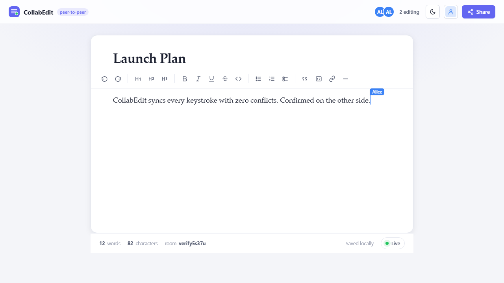

<div align="center">

# CollabEdit

### Real-time collaborative rich-text editor — Google-Docs-style multiplayer editing, with **no server**.

Type together, see each other's cursors live, and merge every edit conflict-free with CRDTs.
Pure peer-to-peer over WebRTC. Works offline. Deploys to a static host for **$0**.



</div>

---

## Why this is interesting

Real-time collaboration looks simple until two people edit the same word at the same instant — then naïve apps corrupt the document. CollabEdit solves this with a **CRDT** (Conflict-free Replicated Data Type) via [Yjs](https://github.com/yjs/yjs): every keystroke is a commutative operation, so all peers **mathematically converge on the same document** regardless of network ordering, latency, or who typed first. No operational-transform server, no lock, no "someone else is editing" banners.

And there's **no backend to run**. Browsers connect **directly to each other over WebRTC**; a public signaling server is used only to introduce peers (it never sees your content). Everything else — merging, presence, persistence — happens client-side.

## Features

- **Full rich-text editing** — headings, bold/italic/underline/strike, inline code, ordered/bulleted/task lists, blockquotes, code blocks, links, and dividers (Tiptap / ProseMirror).
- **Live multiplayer cursors** — see every collaborator's caret and name, colour-coded, moving in real time.
- **Presence** — stacked avatars show who's in the room; a status pill shows live / waiting / offline.
- **Shareable rooms** — the room id lives in the URL hash, so collaborating is just sharing a link. No accounts.
- **Offline-first** — the document persists to IndexedDB; edit with no connection and it syncs automatically when peers reconnect.
- **CRDT-aware undo/redo** — undo only reverts *your* changes, even amid concurrent edits.
- **Identity** — pick your display name and cursor colour; persisted across sessions.
- **Light / dark theme**, live word & character counts, fully keyboard-accessible toolbar.
- **Tiny app shell** (~7 kB gzip) on top of the editor vendor chunk.

## How it works

```
        ┌──────────────┐   WebRTC data channel    ┌──────────────┐
        │   Browser A  │◄────────(P2P)───────────►│   Browser B  │
        │              │                           │              │
        │  Tiptap UI   │   ┌──────────────────┐    │  Tiptap UI   │
        │     ▲        │   │ Signaling server │    │     ▲        │
        │     │        │   │ (peer introductions │  │     │        │
        │  Yjs Y.Doc ──┼──►│  only — no content) │◄─┼── Yjs Y.Doc  │
        │     │        │   └──────────────────┘    │     │        │
        │  IndexedDB   │                           │  IndexedDB   │
        │  (offline)   │                           │  (offline)   │
        └──────────────┘                           └──────────────┘
```

| Layer | Library | Role |
|-------|---------|------|
| Editor | `@tiptap/react` + ProseMirror | Rich-text view & schema |
| CRDT | `yjs` | Conflict-free shared document |
| Transport | `y-webrtc` | Peer-to-peer sync + presence (awareness) |
| Persistence | `y-indexeddb` | Local-first offline storage |
| Cursors | `@tiptap/extension-collaboration-cursor` | Remote carets & labels |

The binding lives in [`src/collab/`](src/collab): `useCollaboration.ts` owns the document/provider/persistence lifecycle, and `useDocEditor.ts` attaches Tiptap to the shared `Y.Doc` (with StarterKit's history disabled in favour of the CRDT undo manager).

## Run locally

```bash
npm install
npm run dev          # http://localhost:5173
```

Open the URL, then **open the same link in a second tab or browser** — start typing and watch them sync. (Tabs in one browser sync instantly via BroadcastChannel; across devices it uses WebRTC.)

## Verify it really works

A Playwright test drives two independent peers in one room and asserts the document converges in both directions:

```bash
npm run build
npm run verify
```

```
✓ Body synced to second peer
✓ Title synced to second peer
✓ Reverse sync confirmed (bidirectional CRDT merge)
✓ Remote collaborator cursor rendered
VERIFICATION PASSED — real-time collaboration works end to end.
```

## Deploy

Static output — host anywhere. For Vercel:

```bash
npm i -g vercel
vercel            # or: connect the GitHub repo in the Vercel dashboard
```

`vercel.json` is preconfigured (Vite framework, hashed-asset caching). No environment variables, no server.

## Tech stack

`React 18` · `TypeScript` · `Vite 6` · `Yjs` · `y-webrtc` · `y-indexeddb` · `Tiptap` · `ProseMirror`

## Project structure

```
src/
├── collab/
│   ├── useCollaboration.ts   # Y.Doc + WebRTC + IndexedDB + awareness
│   ├── useDocEditor.ts       # Tiptap ⇄ Yjs binding
│   ├── identity.ts           # persisted name + colour
│   └── room.ts               # shareable room id in URL hash
├── components/               # Toolbar, PresenceBar, Share/Identity popovers, …
├── lib/                      # icons, theme & toast hooks
├── styles/                   # design system + editor/cursor CSS
└── App.tsx                   # composition
```

## A note on signaling

Peer discovery uses public Yjs signaling servers (listed in `useCollaboration.ts`). They only broker the WebRTC handshake — **document content is always exchanged directly between browsers and is never sent to them.** For production traffic you can self-host a signaling server (`npx y-webrtc-signaling`) and swap the URLs.

---

<div align="center">
Built with Yjs CRDTs — because merging edits should be math, not luck.
</div>
